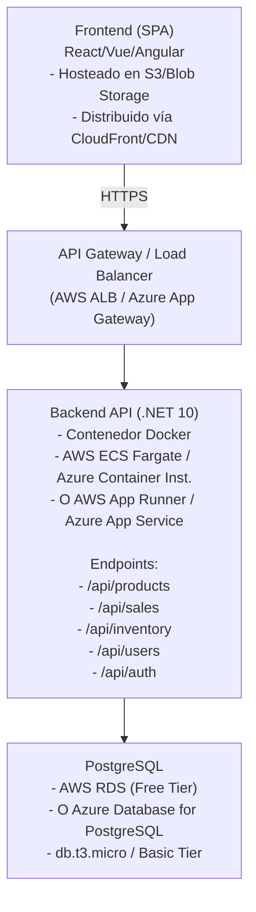
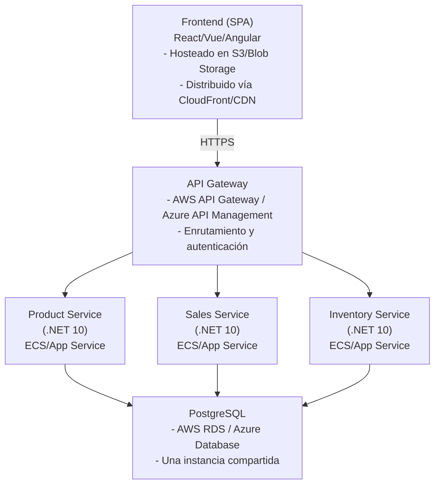
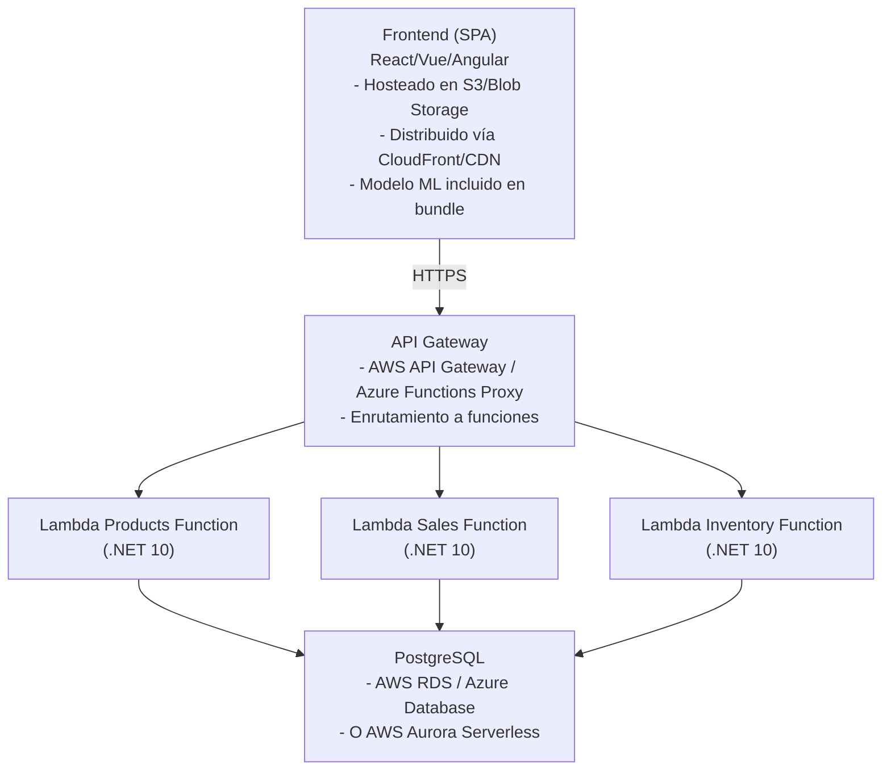

# Propuesta de Arquitecturas - Sistema de Gestión de Puntos de Venta

## Contexto del Proyecto

- **Backend**: .NET 10
- **Frontend**: React/Vue/Angular (SPA)
- **Base de datos**: PostgreSQL
- **Reconocimiento de imágenes**: Modelo propio ejecutándose en cliente
- **Usuarios concurrentes**: 2-3
- **Productos**: ~500
- **Despliegue**: Free-tier AWS/Azure
- **Repositorio**: GitHub

---

## Arquitectura 1: Monolítica Simple con Contenedores

### Descripción

Arquitectura tradicional con backend monolítico y frontend separado, desplegados en contenedores Docker sobre servicios gestionados de cloud.

### Componentes

### Servicios Cloud (Free-tier)

**AWS:**
- **Frontend**: S3 + CloudFront (1TB transferencia/mes gratis)
- **Backend**: AWS App Runner o ECS Fargate (750 horas/mes gratis)
- **Base de datos**: RDS PostgreSQL db.t3.micro (750 horas/mes gratis)
- **API Gateway**: API Gateway (1M requests/mes gratis)

**Azure:**
- **Frontend**: Azure Blob Storage + Azure CDN (5GB storage, 15GB transferencia/mes)
- **Backend**: Azure App Service (F1 Free tier - 1GB RAM, 1GB storage)
- **Base de datos**: Azure Database for PostgreSQL Flexible Server (B1ms - 1 vCore, 2GB RAM)
- **API Management**: Azure API Management (Developer tier - limitado pero funcional)

### Pros

✅ **Simplicidad**: Arquitectura fácil de entender y mantener
✅ **Despliegue sencillo**: Contenedores facilitan el despliegue y versionado
✅ **Costo**: Muy bajo en free-tier para el volumen esperado
✅ **Desarrollo rápido**: Menos complejidad operacional
✅ **Debugging fácil**: Todo centralizado facilita la depuración
✅ **Escalabilidad vertical**: Fácil aumentar recursos si crece el proyecto
✅ **Ideal para MVP**: Perfecto para comenzar rápido

### Contras

❌ **Escalabilidad horizontal limitada**: Escalar requiere replicar todo el backend
❌ **Acoplamiento**: Cambios en una parte pueden afectar otras
❌ **Punto único de fallo**: Si el backend cae, toda la aplicación cae
❌ **Límites de free-tier**: Puede requerir upgrade si crece el tráfico
❌ **Deploy completo**: Cualquier cambio requiere redeploy completo del backend

### Costo Estimado (Free-tier)

- **AWS**: $0-5/mes (dentro de límites free-tier)
- **Azure**: $0-5/mes (dentro de límites free-tier)

---

## Arquitectura 2: Microservicios Básicos con API Gateway

### Descripción

Arquitectura desacoplada con servicios especializados separados, comunicándose a través de API Gateway.

### Componentes

### Servicios Cloud (Free-tier)

**AWS:**
- **Frontend**: S3 + CloudFront
- **API Gateway**: API Gateway (1M requests/mes)
- **Microservicios**: AWS App Runner o ECS Fargate (750 horas/mes compartidas)
- **Base de datos**: RDS PostgreSQL db.t3.micro

**Azure:**
- **Frontend**: Blob Storage + CDN
- **API Management**: Developer tier
- **Microservicios**: Azure App Service (múltiples instancias F1 Free)
- **Base de datos**: Azure Database for PostgreSQL

### Pros

✅ **Separación de responsabilidades**: Cada servicio tiene un propósito claro
✅ **Escalabilidad independiente**: Escalar solo el servicio que lo necesite
✅ **Desarrollo paralelo**: Equipos pueden trabajar en servicios diferentes
✅ **Tecnología flexible**: Cada servicio puede usar tecnologías diferentes (futuro)
✅ **Resiliencia**: Fallo en un servicio no afecta a otros
✅ **Deploy independiente**: Actualizar un servicio sin afectar otros

### Contras

❌ **Complejidad operacional**: Más servicios que gestionar y monitorear
❌ **Overhead de comunicación**: Latencia entre servicios
❌ **Gestión de transacciones**: Más complejo manejar transacciones distribuidas
❌ **Debugging complejo**: Rastrear requests a través de múltiples servicios
❌ **Costo**: Más recursos necesarios (aunque en free-tier puede funcionar)
❌ **Overkill para MVP**: Demasiada complejidad para 2-3 usuarios concurrentes
❌ **Límites free-tier**: Puede ser difícil mantener múltiples servicios en free-tier

### Costo Estimado (Free-tier)

- **AWS**: $0-10/mes (puede exceder free-tier con múltiples servicios)
- **Azure**: $0-10/mes (múltiples App Services pueden ser limitantes)

---

## Arquitectura 3: Serverless con Funciones

### Descripción

Arquitectura completamente serverless usando funciones como servicio (FaaS) y servicios gestionados.

### Componentes

### Servicios Cloud (Free-tier)

**AWS:**
- **Frontend**: S3 + CloudFront
- **API Gateway**: API Gateway (1M requests/mes)
- **Funciones**: AWS Lambda (.NET 10 runtime)
  - 1M requests/mes gratis
  - 400,000 GB-segundos de compute/mes gratis
- **Base de datos**: RDS PostgreSQL db.t3.micro o Aurora Serverless v2

**Azure:**
- **Frontend**: Blob Storage + CDN
- **API Management**: Developer tier
- **Funciones**: Azure Functions (.NET 10)
  - 1M requests/mes gratis
  - 400,000 GB-segundos gratis
- **Base de datos**: Azure Database for PostgreSQL

### Pros

✅ **Escalabilidad automática**: Escala automáticamente según demanda
✅ **Pago por uso**: Solo pagas por lo que usas (ideal para free-tier)
✅ **Sin gestión de servidores**: Completamente gestionado por el proveedor
✅ **Alta disponibilidad**: Distribución automática en múltiples zonas
✅ **Costos muy bajos**: Excelente para bajo volumen (2-3 usuarios)
✅ **Deploy rápido**: Actualizar funciones es muy rápido
✅ **Resiliencia**: Fallo en una función no afecta otras

### Contras

❌ **Cold start**: Primera invocación puede tener latencia (especialmente .NET)
❌ **Límites de tiempo**: Funciones tienen timeout máximo (15 min AWS, 10 min Azure)
❌ **Debugging complejo**: Más difícil depurar funciones distribuidas
❌ **Vendor lock-in**: Más dependencia del proveedor cloud
❌ **Conexiones DB**: Gestión de pool de conexiones más compleja
❌ **Costo impredecible**: Si crece el tráfico, costos pueden escalar rápido
❌ **Limitaciones de memoria**: Límites de memoria por función

### Costo Estimado (Free-tier)

- **AWS**: $0-3/mes (dentro de límites free-tier para bajo volumen)
- **Azure**: $0-3/mes (dentro de límites free-tier)

---

## Comparativa Resumida

| Aspecto | Monolítica | Microservicios | Serverless |
|--------|-----------|----------------|------------|
| **Complejidad** | Baja | Alta | Media |
| **Costo Free-tier** | Muy bajo | Medio | Muy bajo |
| **Escalabilidad** | Vertical | Horizontal | Automática |
| **Tiempo desarrollo** | Rápido | Lento | Medio |
| **Mantenimiento** | Fácil | Difícil | Medio |
| **Ideal para MVP** | ✅ Excelente | ❌ No | ✅ Bueno |
| **Cold start** | No | No | Sí (.NET) |

---

## Recomendación para tu Proyecto

### Para MVP (Fase 1): **Arquitectura 1 - Monolítica Simple**

**Razones:**
- ✅ Perfecta para 2-3 usuarios concurrentes
- ✅ Desarrollo más rápido
- ✅ Menor complejidad operacional
- ✅ Fácil de mantener y debuggear
- ✅ Costos mínimos en free-tier
- ✅ Fácil migración futura si crece

### Migración Futura (Fase 2+):

Si el proyecto crece significativamente:
- **Opción A**: Mantener monolítica pero escalar verticalmente
- **Opción B**: Migrar a Serverless si el tráfico es intermitente
- **Opción C**: Migrar a Microservicios solo si realmente se necesita separación de equipos/tecnologías

---

## Consideraciones Adicionales

### Reconocimiento de Imágenes en Cliente

Dado que el modelo ML se ejecuta en cliente:
- ✅ El modelo se incluye en el bundle del frontend
- ✅ No hay carga en el backend para inferencia
- ✅ Solo se envía la imagen al backend para almacenarla tras la venta
- ✅ Considerar compresión de imágenes antes de subirlas

### Base de Datos PostgreSQL

- ✅ Usar connection pooling (PgBouncer o Npgsql pooling)
- ✅ Índices apropiados en SKU, punto de venta, fechas
- ✅ Considerar backups automáticos (incluidos en free-tier)

### Autenticación

- ✅ JWT tokens para autenticación stateless
- ✅ Refresh tokens para seguridad
- ✅ Almacenamiento seguro en cliente (httpOnly cookies o localStorage)

### Almacenamiento de Imágenes

- ✅ S3/Blob Storage para fotos de productos y ventas
- ✅ CDN para distribución rápida
- ✅ Políticas de lifecycle para optimizar costos

