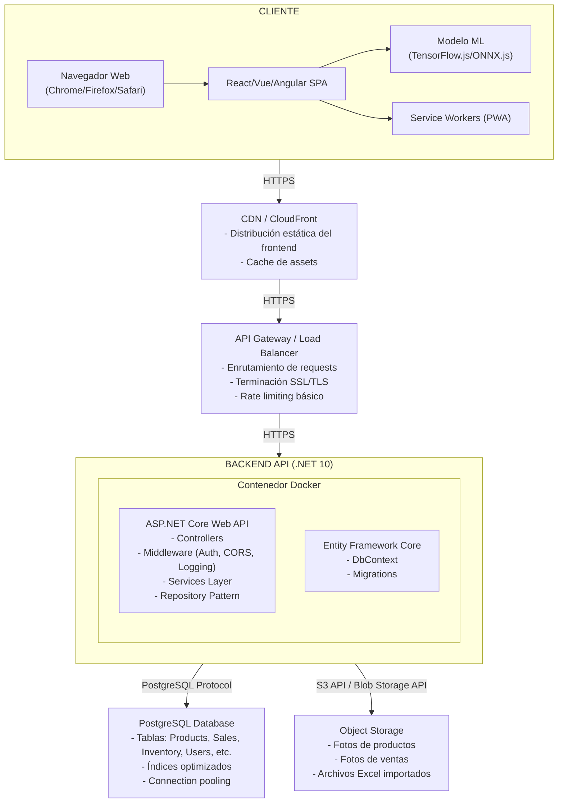
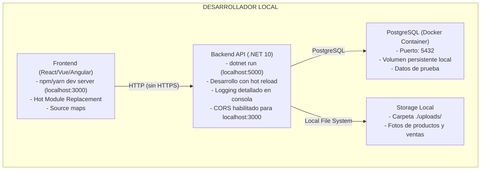
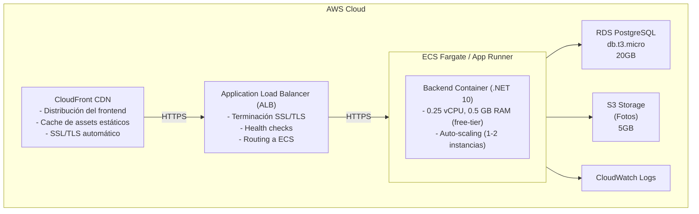
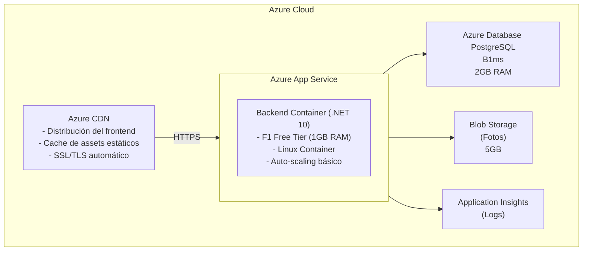
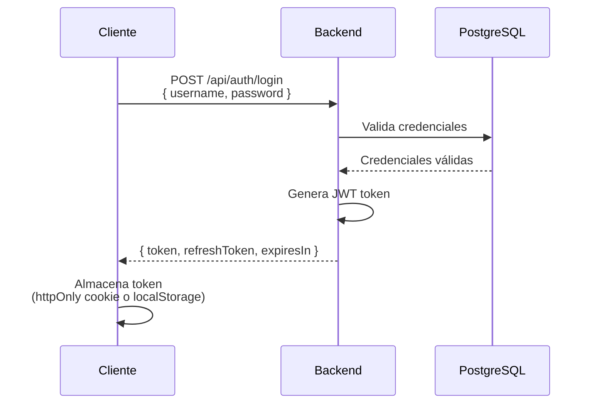
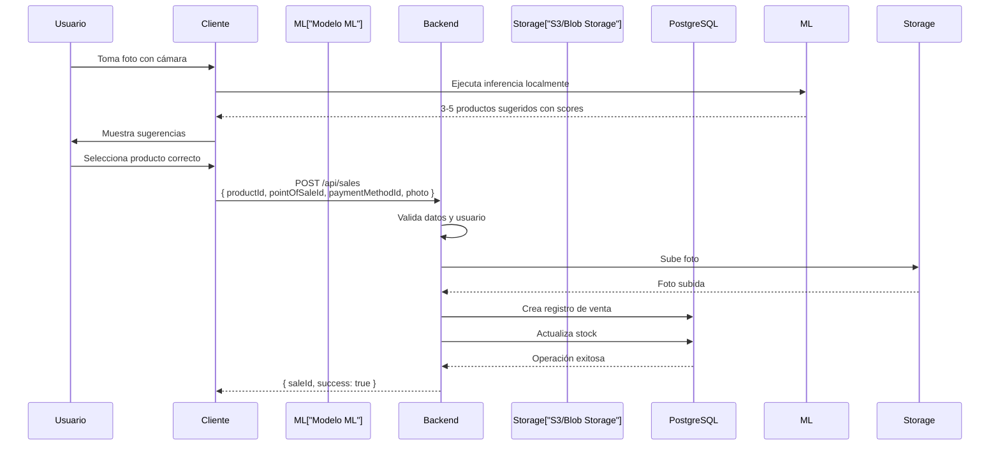
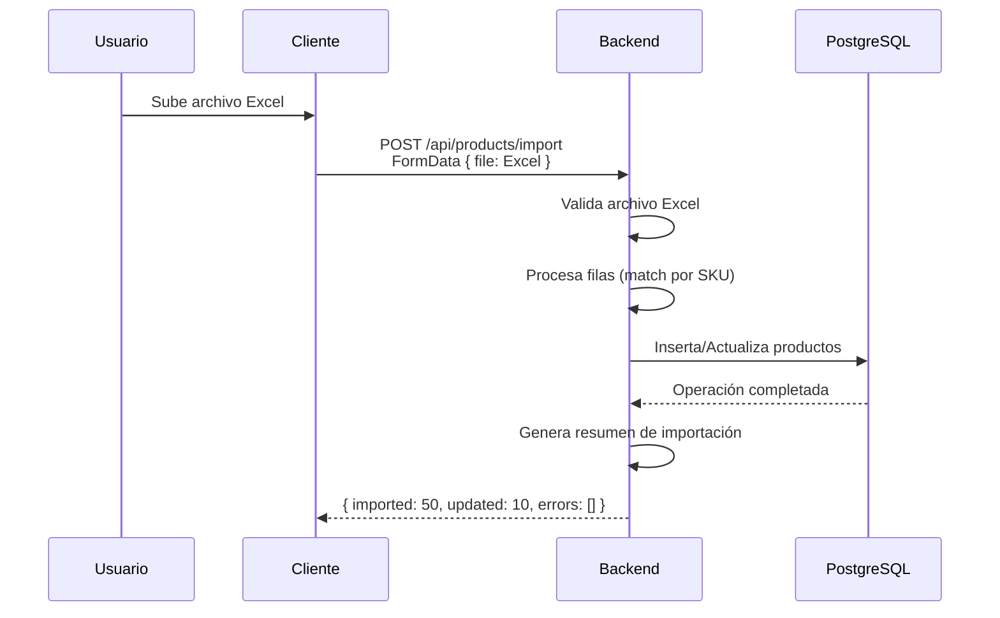

# Arquitectura del Sistema - Monolítica Simple con Contenedores

## Visión General

Arquitectura monolítica simple con backend y frontend separados, desplegados en contenedores Docker sobre servicios gestionados de cloud en free-tier.

---

## Stack Tecnológico

### Backend
- **Framework**: .NET 10 (ASP.NET Core Web API)
- **Lenguaje**: C#
- **ORM**: Entity Framework Core
- **Base de datos**: PostgreSQL 15+
- **Autenticación**: JWT (JSON Web Tokens)
- **Contenedorización**: Docker
- **Logging**: Serilog

### Frontend
- **Framework**: React/Vue/Angular (SPA)
- **Lenguaje**: TypeScript
- **Estado**: Redux/Vuex/NgRx (según framework elegido)
- **HTTP Client**: Axios/Fetch
- **UI Components**: Material-UI / Vuetify / Angular Material
- **ML Framework**: TensorFlow.js / ONNX.js (para reconocimiento de imágenes en cliente)
- **Build Tool**: Vite / Webpack

### Infraestructura
- **Contenedores**: Docker
- **Orquestación**: Docker Compose (desarrollo) / Cloud Services (producción)
- **CI/CD**: GitHub Actions
- **Repositorio**: GitHub

---

## Arquitectura Detallada

### Diagrama de Componentes



---

## Entorno de Desarrollo

### Arquitectura Local



### Configuración de Desarrollo

#### Docker Compose (docker-compose.dev.yml)

```yaml
version: '3.8'

services:
  postgres-dev:
    image: postgres:15-alpine
    container_name: joyeria-postgres-dev
    environment:
      POSTGRES_DB: joyeria_dev
      POSTGRES_USER: dev_user
      POSTGRES_PASSWORD: dev_password
    ports:
      - "5432:5432"
    volumes:
      - postgres_dev_data:/var/lib/postgresql/data
      - ./scripts/init-db.sql:/docker-entrypoint-initdb.d/init.sql
    healthcheck:
      test: ["CMD-SHELL", "pg_isready -U dev_user"]
      interval: 10s
      timeout: 5s
      retries: 5

  backend-dev:
    build:
      context: ./backend
      dockerfile: Dockerfile.dev
    container_name: joyeria-backend-dev
    environment:
      - ASPNETCORE_ENVIRONMENT=Development
      - ConnectionStrings__DefaultConnection=Host=postgres-dev;Port=5432;Database=joyeria_dev;Username=dev_user;Password=dev_password
      - JWT__SecretKey=dev-secret-key-change-in-production
      - JWT__Issuer=JoyeriaAPI-Dev
      - Storage__Type=Local
      - Storage__LocalPath=./uploads
    ports:
      - "5000:8080"
    volumes:
      - ./backend:/app
      - ./uploads:/app/uploads
    depends_on:
      postgres-dev:
        condition: service_healthy
    command: dotnet watch run --urls http://0.0.0.0:8080

volumes:
  postgres_dev_data:
```

#### Variables de Entorno - Desarrollo

**Backend (.env.dev)**
```env
ASPNETCORE_ENVIRONMENT=Development
ASPNETCORE_URLS=http://localhost:5000

# Database
ConnectionStrings__DefaultConnection=Host=localhost;Port=5432;Database=joyeria_dev;Username=dev_user;Password=dev_password

# JWT
JWT__SecretKey=dev-secret-key-minimum-32-characters-long
JWT__Issuer=JoyeriaAPI-Dev
JWT__Audience=JoyeriaClient-Dev
JWT__ExpirationMinutes=1440

# Storage
Storage__Type=Local
Storage__LocalPath=./uploads

# CORS
CORS__AllowedOrigins=http://localhost:3000,http://localhost:5173

# Logging
Logging__LogLevel__Default=Debug
Logging__LogLevel__Microsoft=Information
Logging__LogLevel__Microsoft.AspNetCore=Warning
```

**Frontend (.env.development)**
```env
VITE_API_BASE_URL=http://localhost:5000/api
VITE_ENVIRONMENT=development
VITE_ENABLE_DEV_TOOLS=true
```

### Características de Desarrollo

- **Hot Reload**: Cambios en código se reflejan automáticamente
- **Source Maps**: Debugging completo en navegador
- **Logging Detallado**: Logs completos en consola
- **Datos de Prueba**: Seeders para datos iniciales
- **Sin HTTPS**: Desarrollo local sin certificados SSL
- **CORS Permisivo**: Permite requests desde localhost
- **Errores Detallados**: Stack traces completos en respuestas

---

## Entorno de Producción

### Arquitectura en Cloud (Free-tier)

#### Opción AWS



#### Opción Azure



### Configuración de Producción

#### Dockerfile de Producción (Backend)

```dockerfile
# Build stage
FROM mcr.microsoft.com/dotnet/sdk:10.0 AS build
WORKDIR /src

# Copy csproj and restore dependencies
COPY ["Joyeria.API/Joyeria.API.csproj", "Joyeria.API/"]
RUN dotnet restore "Joyeria.API/Joyeria.API.csproj"

# Copy everything else and build
COPY . .
WORKDIR "/src/Joyeria.API"
RUN dotnet build "Joyeria.API.csproj" -c Release -o /app/build

# Publish stage
FROM build AS publish
RUN dotnet publish "Joyeria.API.csproj" -c Release -o /app/publish

# Runtime stage
FROM mcr.microsoft.com/dotnet/aspnet:10.0 AS final
WORKDIR /app

# Install curl for health checks
RUN apt-get update && apt-get install -y curl && rm -rf /var/lib/apt/lists/*

COPY --from=publish /app/publish .

# Create non-root user
RUN groupadd -r appuser && useradd -r -g appuser appuser
RUN chown -R appuser:appuser /app
USER appuser

EXPOSE 8080

ENV ASPNETCORE_URLS=http://+:8080
ENV ASPNETCORE_ENVIRONMENT=Production

ENTRYPOINT ["dotnet", "Joyeria.API.dll"]
```

#### Variables de Entorno - Producción

**Backend (Azure App Service / AWS ECS)**
```env
ASPNETCORE_ENVIRONMENT=Production
ASPNETCORE_URLS=http://+:8080

# Database (desde Azure Key Vault / AWS Secrets Manager)
ConnectionStrings__DefaultConnection=<from-secrets>

# JWT (desde secrets)
JWT__SecretKey=<from-secrets-min-32-chars>
JWT__Issuer=JoyeriaAPI-Prod
JWT__Audience=JoyeriaClient-Prod
JWT__ExpirationMinutes=480

# Storage
Storage__Type=Cloud
Storage__Provider=AWS-S3|Azure-Blob
Storage__BucketName=joyeria-photos-prod
Storage__Region=us-east-1|westeurope

# CORS
CORS__AllowedOrigins=https://joyeria-app.com,https://www.joyeria-app.com

# Logging
Logging__LogLevel__Default=Information
Logging__LogLevel__Microsoft=Warning
Logging__LogLevel__Microsoft.AspNetCore=Warning
```

**Frontend (Build de Producción)**
```env
VITE_API_BASE_URL=https://api.joyeria-app.com/api
VITE_ENVIRONMENT=production
VITE_ENABLE_DEV_TOOLS=false
```

### Características de Producción

- **HTTPS Obligatorio**: Todas las comunicaciones cifradas
- **CORS Restrictivo**: Solo dominios permitidos
- **Logging Estructurado**: Logs a CloudWatch/Application Insights
- **Health Checks**: Endpoints para monitoreo
- **Connection Pooling**: Optimización de conexiones DB
- **Caching**: CDN para assets estáticos
- **Secrets Management**: Credenciales en servicios gestionados
- **Error Handling**: Respuestas genéricas sin detalles internos

---

## Diferencias Clave: Desarrollo vs Producción

| Aspecto | Desarrollo | Producción |
|---------|-----------|------------|
| **Entorno** | Local (Docker Compose) | Cloud (AWS/Azure) |
| **HTTPS** | No (HTTP localhost) | Sí (SSL/TLS) |
| **CORS** | Permisivo (localhost) | Restrictivo (dominios específicos) |
| **Logging** | Consola (Debug) | CloudWatch/App Insights (Info/Warning) |
| **Errores** | Stack traces completos | Mensajes genéricos |
| **Base de Datos** | PostgreSQL local (Docker) | RDS/Azure Database |
| **Storage** | Sistema de archivos local | S3/Blob Storage |
| **Build** | Hot reload | Build optimizado |
| **Secrets** | Archivos .env | Key Vault/Secrets Manager |
| **Monitoreo** | Manual (consola) | Automático (CloudWatch/Insights) |
| **Escalabilidad** | 1 instancia | Auto-scaling (1-2 instancias) |

---

## Estructura del Proyecto

```
joyeria-pos/
├── backend/
│   ├── Joyeria.API/
│   │   ├── Controllers/
│   │   ├── Services/
│   │   ├── Repositories/
│   │   ├── Models/
│   │   ├── Middleware/
│   │   ├── Program.cs
│   │   └── appsettings.json
│   ├── Joyeria.Core/
│   │   ├── Entities/
│   │   ├── Interfaces/
│   │   └── DTOs/
│   ├── Joyeria.Infrastructure/
│   │   ├── Data/
│   │   ├── Repositories/
│   │   └── Migrations/
│   └── Dockerfile
├── frontend/
│   ├── src/
│   │   ├── components/
│   │   ├── services/
│   │   ├── stores/
│   │   ├── models/
│   │   └── ml/ (modelo de reconocimiento)
│   ├── public/
│   ├── package.json
│   └── Dockerfile
├── docker-compose.dev.yml
├── docker-compose.prod.yml
├── .github/
│   └── workflows/
│       └── ci-cd.yml
└── documentation/
    └── Arquitectura.md
```

---

## Flujos de Datos Principales

### 1. Flujo de Autenticación



### 2. Flujo de Reconocimiento de Imagen



### 3. Flujo de Importación de Productos



---

## Seguridad

### Autenticación y Autorización

- **JWT Tokens**: Stateless authentication
- **Refresh Tokens**: Renovación automática de sesión
- **Password Hashing**: BCrypt con salt
- **Role-Based Access Control**: Admin vs Operador
- **CORS**: Configurado por origen permitido

### Protección de Datos

- **HTTPS**: Todas las comunicaciones cifradas
- **Secrets Management**: Credenciales en servicios gestionados
- **SQL Injection**: Prevención mediante Entity Framework Core
- **XSS**: Sanitización de inputs
- **CSRF**: Tokens CSRF en formularios

### Almacenamiento Seguro

- **S3/Blob Storage**: Políticas de acceso restringidas
- **Pre-signed URLs**: Para acceso temporal a imágenes
- **Encriptación**: Datos en reposo encriptados

---

## Optimizaciones para Free-tier

### Backend

- **Connection Pooling**: Máximo 5-10 conexiones simultáneas
- **Caching**: Cache en memoria para datos frecuentes (productos)
- **Lazy Loading**: Carga diferida de relaciones
- **Paginación**: Todas las listas paginadas (máx 50 items/página)
- **Compresión**: Respuestas comprimidas (gzip)

### Base de Datos

- **Índices Optimizados**: 
  - SKU (único)
  - PointOfSaleId + ProductId (ventas)
  - CreatedAt (búsquedas por fecha)
- **VACUUM Regular**: Limpieza automática de PostgreSQL
- **Queries Optimizadas**: Evitar N+1 queries

### Frontend

- **Code Splitting**: Carga diferida de módulos
- **Lazy Loading**: Componentes cargados bajo demanda
- **Image Optimization**: Compresión y formatos modernos (WebP)
- **Bundle Size**: Minimizar tamaño del bundle (< 500KB inicial)
- **Service Workers**: Cache de assets estáticos

### Storage

- **Image Compression**: Reducir tamaño antes de subir
- **Lifecycle Policies**: Eliminar imágenes antiguas automáticamente
- **CDN**: Cache agresivo de imágenes

---

## Monitoreo y Logging

### Logging

- **Serilog**: Backend logging estructurado
- **Niveles**: Debug (dev), Information/Warning (prod)
- **Destinos**: 
  - Desarrollo: Consola
  - Producción: CloudWatch Logs / Application Insights

### Health Checks

- **Endpoint**: `/health`
- **Checks**:
  - Database connectivity
  - Storage connectivity
  - Memory usage

### Métricas Clave

- **Request Rate**: Requests por minuto
- **Response Time**: Tiempo promedio de respuesta
- **Error Rate**: Porcentaje de errores
- **Database Connections**: Conexiones activas
- **Storage Usage**: Espacio utilizado

---

## CI/CD Pipeline

### GitHub Actions Workflow

```yaml
name: Build and Deploy

on:
  push:
    branches: [ main, develop ]

jobs:
  build-backend:
    runs-on: ubuntu-latest
    steps:
      - uses: actions/checkout@v3
      - name: Build Docker image
        run: docker build -t joyeria-backend ./backend
      - name: Run tests
        run: docker run joyeria-backend dotnet test
      
  build-frontend:
    runs-on: ubuntu-latest
    steps:
      - uses: actions/checkout@v3
      - name: Build frontend
        run: |
          cd frontend
          npm install
          npm run build
      
  deploy:
    needs: [build-backend, build-frontend]
    runs-on: ubuntu-latest
    if: github.ref == 'refs/heads/main'
    steps:
      - name: Deploy to AWS/Azure
        # Configurar deployment según proveedor
```

---

## Consideraciones de Escalabilidad Futura

### Si el Proyecto Crece

1. **Escalar Verticalmente**: Aumentar recursos de instancia (RAM, CPU)
2. **Escalar Horizontalmente**: Múltiples instancias con load balancer
3. **Read Replicas**: Réplicas de lectura para PostgreSQL
4. **Caching Layer**: Redis para cache distribuido
5. **CDN Ampliado**: Más puntos de presencia
6. **Migración a Microservicios**: Solo si realmente necesario

### Límites de Free-tier

- **AWS**: 
  - RDS: 750 horas/mes (db.t3.micro)
  - ECS: 750 horas/mes
  - S3: 5GB storage, 20,000 GET requests
- **Azure**:
  - App Service: F1 Free (1GB RAM, limitado)
  - Database: B1ms (limitado)
  - Blob Storage: 5GB

**Recomendación**: Monitorear uso y planificar upgrade antes de alcanzar límites.

---

## Checklist de Despliegue

### Pre-despliegue

- [ ] Variables de entorno configuradas
- [ ] Secrets en Key Vault/Secrets Manager
- [ ] Base de datos creada y migraciones aplicadas
- [ ] Storage buckets/containers creados
- [ ] Certificados SSL configurados
- [ ] Dominios DNS configurados
- [ ] Health checks funcionando

### Post-despliegue

- [ ] Verificar conectividad base de datos
- [ ] Verificar acceso a storage
- [ ] Probar autenticación
- [ ] Probar reconocimiento de imágenes
- [ ] Verificar logs en CloudWatch/Insights
- [ ] Probar health checks
- [ ] Verificar CORS
- [ ] Probar en dispositivos móviles

---

## Conclusión

Esta arquitectura monolítica simple con contenedores es ideal para el MVP del sistema de gestión de puntos de venta, proporcionando:

- ✅ Desarrollo rápido y mantenible
- ✅ Costos mínimos en free-tier
- ✅ Escalabilidad futura cuando sea necesario
- ✅ Separación clara entre desarrollo y producción
- ✅ Seguridad adecuada para datos sensibles
- ✅ Optimizaciones específicas para free-tier

La arquitectura puede evolucionar fácilmente a microservicios o serverless si el proyecto crece significativamente en el futuro.

---

## Documentación Relacionada

### Deploy en Producción

Para instrucciones detalladas sobre el deploy en AWS, consultar:

- **[Guía de Deploy AWS](Guias/deploy-aws-production.md)**: Instrucciones paso a paso para configurar y desplegar la aplicación en AWS (App Runner, RDS, S3, CloudFront).

- **[Comparación AWS vs Azure](Propuestas/comparacion-aws-azure-deploy.md)**: Análisis detallado de pros y contras de ambas plataformas, costos estimados, y justificación de la elección de AWS.

- **[OpenSpec Proposal](../openspec/changes/add-aws-production-deployment/proposal.md)**: Propuesta técnica formal para la implementación del deploy en AWS.

### Decisiones de Arquitectura

| Decisión | Opción Elegida | Justificación |
|----------|----------------|---------------|
| **Cloud Provider** | AWS | Experiencia del equipo, free-tier generoso |
| **Backend Hosting** | App Runner | Simplicidad, auto-scaling, sin gestión de infra |
| **Database** | RDS PostgreSQL | Managed service, backups automáticos 7 días |
| **File Storage** | S3 | Madurez, SDK .NET excelente, pre-signed URLs |
| **Frontend Hosting** | CloudFront + S3 | CDN global, cache eficiente, bajo costo |
| **Secrets** | Secrets Manager | Seguridad, integración nativa con .NET |
| **CI/CD** | GitHub Actions | Ya en uso, free-tier generoso, actions oficiales AWS |
| **Moneda** | Euro (EUR, €) | Mercado objetivo español/europeo |
| **Locale** | es-ES | Formato español para números y fechas |

### Localización y Formato de Moneda

El sistema está configurado para el mercado español/europeo:

| Configuración | Valor | Descripción |
|---------------|-------|-------------|
| **Moneda** | EUR (€) | Euro como moneda principal |
| **Locale** | es-ES | Español de España |
| **Formato de Precios** | €X.XX | Símbolo € antes del valor, 2 decimales |
| **Intl.NumberFormat** | `es-ES`, `EUR` | Para formateo automático de moneda |

**Implementación Frontend:**
```typescript
// Formato simple
€{price.toFixed(2)}

// Formato con Intl.NumberFormat
new Intl.NumberFormat('es-ES', {
  style: 'currency',
  currency: 'EUR',
}).format(amount);
```

