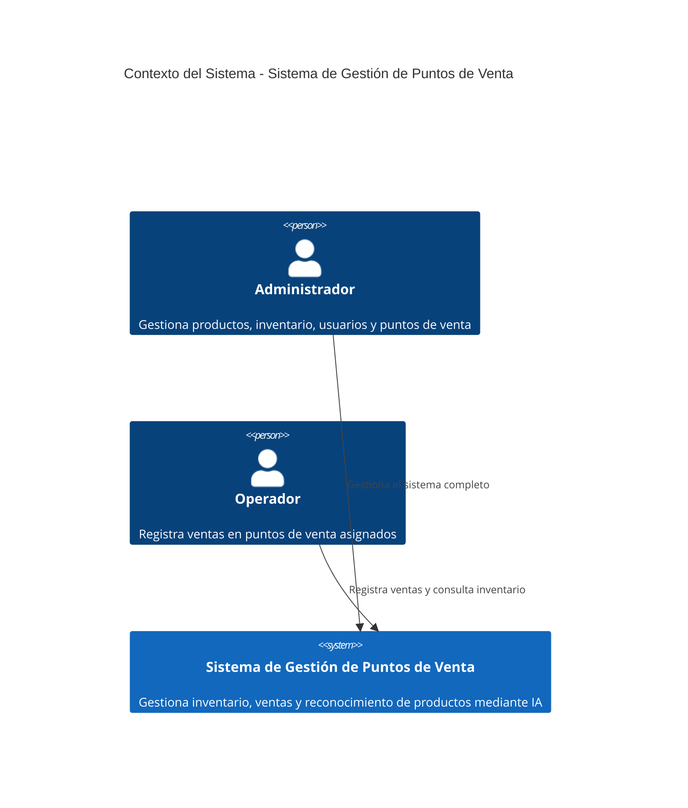
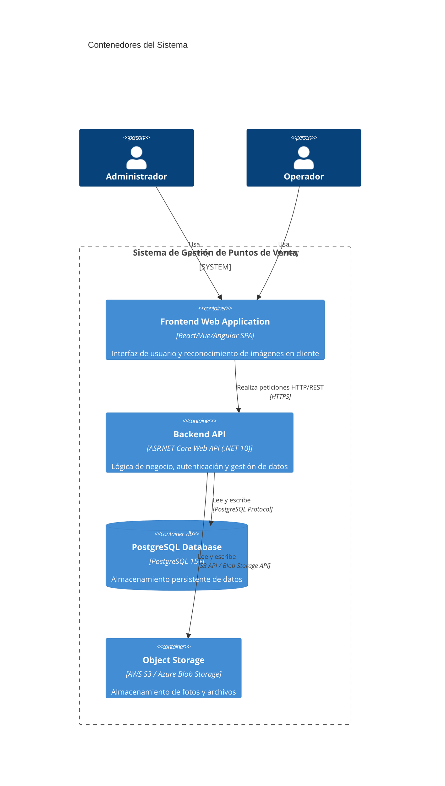
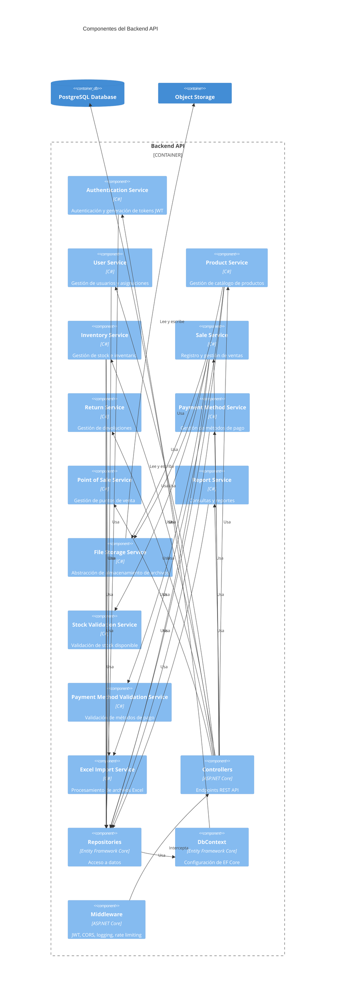
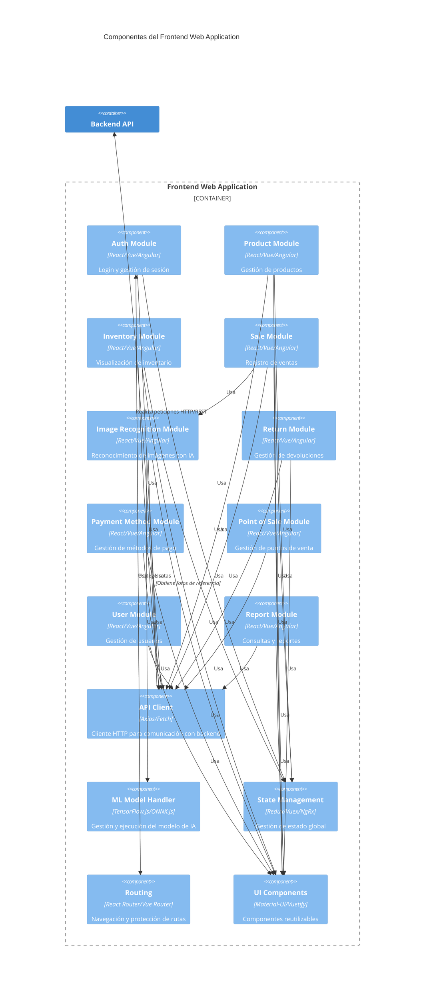

# Modelo C4 - Sistema de Gestión de Puntos de Venta para Joyería

Este documento describe la arquitectura del sistema utilizando el modelo C4, proporcionando diferentes niveles de abstracción desde el contexto general hasta los componentes internos.

---

## Tabla de Contenidos

1. [Nivel 1: Contexto del Sistema](#nivel-1-contexto-del-sistema)
2. [Nivel 2: Contenedores](#nivel-2-contenedores)
3. [Nivel 3: Componentes](#nivel-3-componentes)
   - [3.1 Componentes del Backend](#31-componentes-del-backend)
   - [3.2 Componentes del Frontend](#32-componentes-del-frontend)
4. [Notas sobre Desarrollo vs Producción](#notas-sobre-desarrollo-vs-producción)

---

## Nivel 1: Contexto del Sistema

El **Sistema de Gestión de Puntos de Venta para Joyería** permite gestionar inventario, registrar ventas y facilitar la identificación de productos mediante reconocimiento de imágenes con inteligencia artificial en múltiples puntos de venta (propios y de terceros).

### Actores

- **Administrador**: Usuario con acceso completo al sistema. Puede gestionar productos, inventario, usuarios, puntos de venta, métodos de pago y consultar reportes de todos los puntos de venta.

- **Operador**: Usuario con acceso restringido a puntos de venta asignados. Puede registrar ventas, consultar inventario y gestionar devoluciones en sus puntos de venta asignados.

### Diagrama de Contexto

### Descripción

El sistema permite a los administradores gestionar el catálogo de productos, inventario por punto de venta, usuarios y configuración del sistema. Los operadores utilizan el sistema principalmente desde dispositivos móviles para registrar ventas mediante reconocimiento de imágenes o manualmente, reduciendo errores en la clasificación de productos.

**Características principales:**
- Gestión centralizada de productos e inventario
- Registro de ventas con reconocimiento de imágenes mediante IA
- Gestión de múltiples puntos de venta
- Trazabilidad completa de ventas e inventario
- Optimizado para uso móvil en puntos de venta

---

## Nivel 2: Contenedores

El sistema está compuesto por cuatro contenedores principales: una aplicación web frontend, una API backend, una base de datos PostgreSQL y un servicio de almacenamiento de objetos.

### Contenedores

#### Frontend Web Application
- **Tecnología**: React/Vue/Angular (SPA), TypeScript
- **Responsabilidades**:
  - Interfaz de usuario para administradores y operadores
  - Reconocimiento de imágenes con IA en cliente (TensorFlow.js/ONNX.js)
  - Gestión de sesión y autenticación
  - Comunicación con API backend mediante HTTP/REST
- **Despliegue**: CDN (CloudFront/Azure CDN) en producción, servidor de desarrollo local en desarrollo

#### Backend API
- **Tecnología**: ASP.NET Core Web API (.NET 10), C#
- **Responsabilidades**:
  - Lógica de negocio y reglas de dominio
  - Autenticación y autorización (JWT)
  - Procesamiento de importaciones Excel
  - Validaciones de stock y métodos de pago
  - Gestión de archivos y almacenamiento
- **Despliegue**: Contenedor Docker en ECS Fargate/App Runner (AWS) o Azure App Service

#### PostgreSQL Database
- **Tecnología**: PostgreSQL 15+
- **Responsabilidades**:
  - Almacenamiento persistente de todos los datos del sistema
  - Gestión de productos, inventario, ventas, usuarios, puntos de venta
  - Índices optimizados para consultas frecuentes
- **Despliegue**: RDS PostgreSQL (AWS) o Azure Database for PostgreSQL en producción, contenedor Docker en desarrollo

#### Object Storage
- **Tecnología**: AWS S3 / Azure Blob Storage
- **Responsabilidades**:
  - Almacenamiento de fotos de productos (ProductPhoto)
  - Almacenamiento de fotos de ventas (SalePhoto)
  - Almacenamiento de archivos Excel importados (temporal)
- **Despliegue**: S3 bucket (AWS) o Blob Storage container (Azure) en producción, sistema de archivos local en desarrollo

### Diagrama de Contenedores

### Flujos Principales

#### Flujo de Autenticación
1. Usuario ingresa credenciales en Frontend
2. Frontend envía petición a Backend API (`POST /api/auth/login`)
3. Backend API valida credenciales contra PostgreSQL Database
4. Backend API genera token JWT y lo retorna al Frontend
5. Frontend almacena token y redirige según rol

#### Flujo de Reconocimiento de Imágenes y Venta
1. Operador captura foto del producto en Frontend
2. Frontend procesa imagen localmente con TensorFlow.js/ONNX.js
3. Frontend muestra 3 sugerencias ordenadas por confianza
4. Operador selecciona producto correcto
5. Frontend envía venta a Backend API (`POST /api/sales`)
6. Backend API valida stock y método de pago
7. Backend API crea registro en PostgreSQL Database
8. Backend API sube foto a Object Storage
9. Backend API actualiza inventario en PostgreSQL Database

#### Flujo de Importación de Productos
1. Administrador sube archivo Excel en Frontend
2. Frontend envía archivo a Backend API (`POST /api/products/import`)
3. Backend API procesa Excel y hace matching por SKU
4. Backend API actualiza/crea productos en PostgreSQL Database
5. Backend API retorna resumen de importación al Frontend

---

## Nivel 3: Componentes

### 3.1 Componentes del Backend

El Backend API está organizado en servicios de dominio, controladores REST, repositorios y servicios compartidos.

#### Servicios de Dominio

- **Authentication Service**: Gestiona autenticación de usuarios, generación de tokens JWT, validación de credenciales y control de sesión.

- **User Service**: Gestión de usuarios (crear, editar, desactivar), asignación de operadores a puntos de venta, validación de permisos según roles.

- **Product Service**: Gestión del catálogo de productos (crear, editar, buscar), importación desde Excel con matching por SKU, validación de datos.

- **Inventory Service**: Gestión de stock por punto de venta, importación de stock desde Excel, ajustes manuales, validación de stock disponible, generación de movimientos de inventario.

- **Sale Service**: Registro de ventas, validación de stock y métodos de pago, actualización automática de inventario, generación de movimientos de inventario.

- **Return Service**: Gestión de devoluciones, asociación con venta original, incremento automático de stock, generación de movimientos de inventario.

- **Payment Method Service**: Gestión de métodos de pago disponibles, asignación de métodos a puntos de venta, validación de métodos asignados.

- **Point of Sale Service**: Gestión de puntos de venta (crear, editar, activar/desactivar), validación de asignaciones de operadores.

- **Report Service**: Consultas de historial de ventas con filtros, consultas de inventario, consultas de movimientos de stock, generación de reportes.

#### Servicios Compartidos

- **File Storage Service**: Abstracción para almacenamiento de archivos (local en desarrollo, S3/Blob Storage en producción), gestión de fotos de productos y ventas.

- **Stock Validation Service**: Validación de stock disponible antes de ventas, usado por Sale Service y Return Service.

- **Payment Method Validation Service**: Validación de métodos de pago asignados a puntos de venta, usado por Sale Service.

- **Excel Import Service**: Procesamiento de archivos Excel para importación de productos e inventario, validación de formato y datos.

#### Infraestructura

- **Controllers**: Endpoints REST API organizados por dominio (AuthController, ProductController, SaleController, etc.), validación de entrada, manejo de errores.

- **Repositories**: Acceso a datos mediante Entity Framework Core, abstracción de persistencia, implementación de patrones de repositorio.

- **DbContext**: Configuración de Entity Framework Core, definición de entidades y relaciones, migraciones de base de datos.

- **Middleware**: Autenticación JWT, manejo de errores global, logging, CORS, rate limiting.

#### Diagrama de Componentes del Backend

### 3.2 Componentes del Frontend

El Frontend está organizado en módulos funcionales, servicios y componentes compartidos.

#### Módulos Funcionales

- **Auth Module**: Componentes de login, gestión de sesión, almacenamiento de tokens, redirección según rol, interceptor HTTP para incluir tokens.

- **Product Module**: Componentes para gestión de productos (listado, creación, edición), importación desde Excel, gestión de fotos de productos, búsqueda por SKU o nombre.

- **Inventory Module**: Visualización de stock por punto de venta, vista centralizada de inventario, ajustes manuales de inventario, historial de movimientos.

- **Sale Module**: Componentes para registro de ventas (manual y con reconocimiento), selección de método de pago, validación de stock, confirmación de venta.

- **Image Recognition Module**: Captura de fotos desde cámara móvil, integración con TensorFlow.js/ONNX.js, procesamiento de imágenes, visualización de sugerencias, manejo de errores de reconocimiento.

- **Return Module**: Registro de devoluciones, búsqueda de venta original, asociación con venta, registro de motivo.

- **Payment Method Module**: Gestión de métodos de pago disponibles (solo admin), asignación de métodos a puntos de venta, activación/desactivación.

- **Point of Sale Module**: Gestión de puntos de venta (solo admin), creación, edición, activación/desactivación, asignación de operadores.

- **User Module**: Gestión de usuarios (solo admin), creación, edición, asignación a puntos de venta, control de roles.

- **Report Module**: Consultas de historial de ventas con filtros, visualización de detalles de ventas, consultas de inventario, consultas de movimientos.

#### Servicios y Componentes Compartidos

- **API Client**: Cliente HTTP (Axios/Fetch) para comunicación con backend, configuración de base URL, manejo de errores HTTP, transformación de respuestas.

- **ML Model Handler**: Gestión del modelo TensorFlow.js/ONNX.js, descarga del modelo, carga en memoria, ejecución de inferencia, gestión de versiones del modelo.

- **State Management**: Gestión de estado global (Redux/Vuex/NgRx según framework), store de autenticación, store de productos, store de inventario.

- **Routing**: Configuración de rutas, protección de rutas según roles, navegación programática.

- **UI Components**: Componentes reutilizables (botones, formularios, tablas, modales), diseño responsive, optimizado para móvil.

#### Diagrama de Componentes del Frontend

### Relaciones entre Componentes Backend y Frontend

#### Flujo de Autenticación
1. **Auth Module** (Frontend) → **API Client** → **Backend API** → **Authentication Service** → **Repositories** → **PostgreSQL Database**
2. Token JWT retornado y almacenado en **State Management**
3. **API Client** incluye token en todas las peticiones mediante interceptor

#### Flujo de Reconocimiento de Imágenes y Venta
1. **Image Recognition Module** (Frontend) captura foto
2. **ML Model Handler** procesa imagen localmente
3. **Image Recognition Module** muestra sugerencias
4. **Sale Module** recibe producto seleccionado
5. **Sale Module** → **API Client** → **Backend API** → **Sale Service**
6. **Sale Service** usa **Stock Validation Service** y **Payment Method Validation Service**
7. **Sale Service** → **Repositories** → **PostgreSQL Database**
8. **Sale Service** → **File Storage Service** → **Object Storage**

#### Flujo de Importación de Productos
1. **Product Module** (Frontend) sube archivo Excel
2. **Product Module** → **API Client** → **Backend API** → **Product Service**
3. **Product Service** usa **Excel Import Service** para procesar archivo
4. **Product Service** → **Repositories** → **PostgreSQL Database**

---

## Notas sobre Desarrollo vs Producción

### Almacenamiento de Archivos

**Desarrollo:**
- **File Storage Service** utiliza sistema de archivos local (`./uploads/`)
- Configuración mediante variable de entorno `Storage__Type=Local`
- Sin necesidad de credenciales de cloud

**Producción:**
- **File Storage Service** utiliza AWS S3 o Azure Blob Storage
- Configuración mediante variable de entorno `Storage__Type=Cloud`
- Credenciales gestionadas mediante AWS Secrets Manager / Azure Key Vault
- Políticas de acceso restringidas y pre-signed URLs para acceso temporal

### Base de Datos

**Desarrollo:**
- PostgreSQL ejecutándose en contenedor Docker local
- Puerto 5432 expuesto localmente
- Datos de prueba y seeders para desarrollo
- Sin replicación ni backups automáticos

**Producción:**
- PostgreSQL gestionado (RDS en AWS o Azure Database for PostgreSQL)
- Conexión mediante connection string desde secrets
- Backups automáticos configurados
- Connection pooling optimizado (5-10 conexiones máx para free-tier)

### Frontend

**Desarrollo:**
- Servidor de desarrollo local (Vite/Webpack dev server)
- Hot Module Replacement (HMR) activo
- Source maps para debugging
- Sin optimizaciones de producción

**Producción:**
- Build optimizado y minificado
- Distribución mediante CDN (CloudFront/Azure CDN)
- Cache agresivo de assets estáticos
- Code splitting y lazy loading activados

### Seguridad

**Desarrollo:**
- HTTP sin HTTPS (localhost)
- CORS permisivo para localhost
- Logging detallado en consola
- Stack traces completos en errores

**Producción:**
- HTTPS obligatorio (SSL/TLS)
- CORS restrictivo (solo dominios permitidos)
- Logging estructurado a CloudWatch/Application Insights
- Mensajes de error genéricos (sin detalles internos)
- Rate limiting activo

### Monitoreo

**Desarrollo:**
- Logging manual en consola
- Sin métricas automáticas
- Health checks básicos

**Producción:**
- CloudWatch Logs (AWS) o Application Insights (Azure)
- Métricas automáticas (request rate, response time, error rate)
- Health checks en `/health` endpoint
- Alertas configuradas para errores críticos

### Modelo de IA

**Desarrollo:**
- Modelo descargado desde servidor de desarrollo o local
- Sin optimizaciones de tamaño
- Debugging activo

**Producción:**
- Modelo distribuido mediante CDN
- Modelo optimizado y comprimido
- Versionado del modelo para actualizaciones sin interrupciones

---

## Resumen de Componentes por Épica

### EP1: Gestión de Productos
- **Backend**: Product Service, Excel Import Service, File Storage Service
- **Frontend**: Product Module, API Client

### EP2: Gestión de Inventario
- **Backend**: Inventory Service, Excel Import Service
- **Frontend**: Inventory Module, API Client

### EP3: Registro de Ventas
- **Backend**: Sale Service, Stock Validation Service, Payment Method Validation Service, File Storage Service
- **Frontend**: Sale Module, Image Recognition Module, API Client

### EP4: Reconocimiento de Imágenes con IA
- **Backend**: File Storage Service (para fotos de referencia)
- **Frontend**: Image Recognition Module, ML Model Handler

### EP5: Gestión de Devoluciones
- **Backend**: Return Service, Stock Validation Service
- **Frontend**: Return Module, API Client

### EP6: Gestión de Métodos de Pago
- **Backend**: Payment Method Service, Payment Method Validation Service
- **Frontend**: Payment Method Module, API Client

### EP7: Autenticación y Gestión de Usuarios
- **Backend**: Authentication Service, User Service
- **Frontend**: Auth Module, User Module, API Client

### EP8: Gestión de Puntos de Venta
- **Backend**: Point of Sale Service
- **Frontend**: Point of Sale Module, API Client

### EP9: Consultas y Reportes
- **Backend**: Report Service
- **Frontend**: Report Module, API Client

---

## Consideraciones de Arquitectura

### Patrones Utilizados

- **Repository Pattern**: Abstracción de acceso a datos en el backend
- **Service Layer**: Separación de lógica de negocio de controladores
- **Dependency Injection**: Inyección de dependencias en ASP.NET Core
- **Strategy Pattern**: File Storage Service permite cambiar entre almacenamiento local y cloud
- **Factory Pattern**: Creación de servicios según configuración

### Optimizaciones para Free-tier

- **Connection Pooling**: Máximo 5-10 conexiones simultáneas a PostgreSQL
- **Paginación**: Todas las listas paginadas (máx 50 items/página)
- **Caching**: Cache en memoria para productos y métodos de pago frecuentes
- **Índices Selectivos**: Solo índices necesarios para consultas frecuentes
- **Compresión**: Respuestas comprimidas (gzip) para reducir ancho de banda

### Escalabilidad Futura

El modelo está preparado para escalar:
- **Read Replicas**: Para reportes pesados
- **Caching Distribuido**: Redis para cache compartido entre instancias
- **Microservicios**: Separación de servicios si es necesario en el futuro
- **CDN Ampliado**: Más puntos de presencia para mejor rendimiento global

---

## Referencias

- [Arquitectura del Sistema](arquitectura.md)
- [Modelo de Datos](modelo-de-datos.md)
- [Épicas del MVP](epicas.md)
- [README del Proyecto](../README.md)

