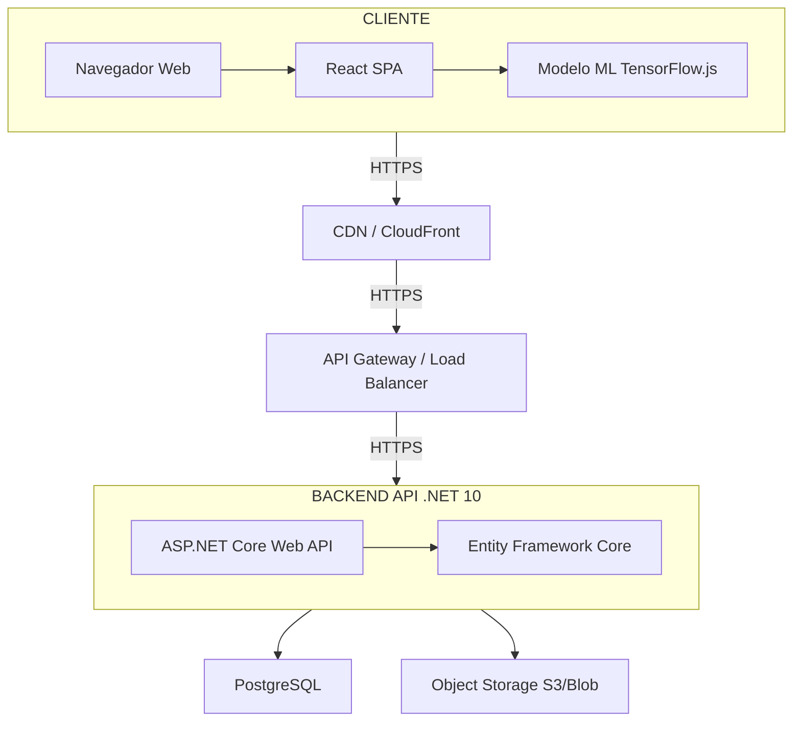
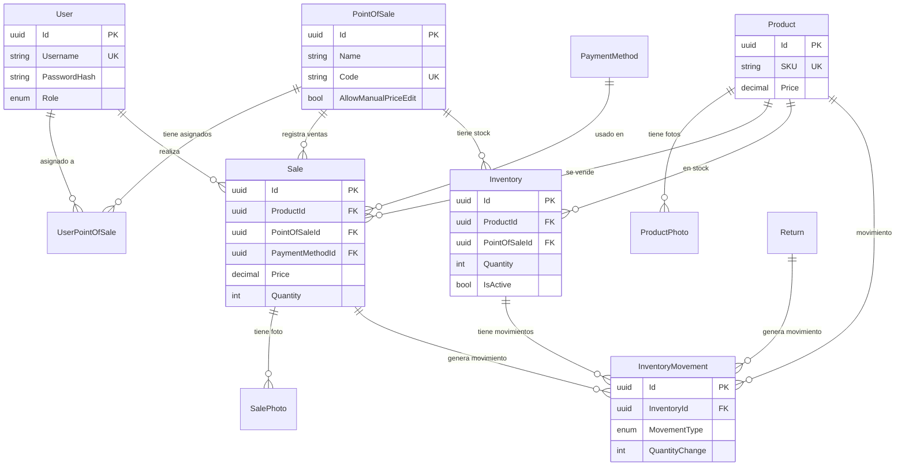

# Sistema de Gestión de Puntos de Venta para Joyería

## Índice

0. [Ficha del proyecto](#0-ficha-del-proyecto)
1. [Descripción general del producto](#1-descripción-general-del-producto)
2. [Arquitectura del sistema](#2-arquitectura-del-sistema)
3. [Modelo de datos](#3-modelo-de-datos)
4. [Especificación de la API](#4-especificación-de-la-api)
5. [Historias de usuario](#5-historias-de-usuario)
6. [Tickets de trabajo](#6-tickets-de-trabajo)

---

## 0. Ficha del proyecto

### 0.1. Tu nombre completo

Marcello Orrico

### 0.2. Nombre del proyecto

Sistema de Gestión de Puntos de Venta para Joyería (Joiabagur PV)

### 0.3. Descripción breve del proyecto

Sistema de gestión integral para una joyería que opera en múltiples puntos de venta (propios y de terceros). Permite gestionar inventario, registrar ventas y facilitar la identificación de productos mediante reconocimiento de imágenes con IA (inferencia y entrenamiento en el navegador con TensorFlow.js).

### 0.4. URL del proyecto

https://pv.joiabagur.com

### 0.5. URL o archivo comprimido del repositorio

https://github.com/marcello-clearcust/joiabagur-pv

---

## 1. Descripción general del producto

### 1.1. Objetivo

El producto tiene como propósito ofrecer una solución integral de gestión para una joyería con varios puntos de venta (tiendas propias y ubicaciones de terceros como hoteles). Aporta valor al centralizar el catálogo de productos, el inventario por ubicación, el registro de ventas con método de pago y la identificación de productos mediante IA en el punto de venta, reduciendo errores y agilizando el proceso. Está dirigido a administradores (gestión completa) y operadores (registro de ventas e inventario en sus puntos asignados).

### 1.2. Características y funcionalidades principales

- **Gestión de productos e inventario:** Catálogo centralizado (SKU, precio, descripción, colección), gestión de stock por punto de venta con vista centralizada, importación y actualización desde Excel, edición manual de productos e inventario, asociación de fotos de referencia para reconocimiento de imágenes.
- **Registro de ventas:** Captura de ventas por punto de venta (manual o con IA), foto opcional por transacción, registro de método de pago, historial con trazabilidad, validación de stock en tiempo real, actualización atómica de inventario, alertas de stock bajo no bloqueantes.
- **Reconocimiento de productos con IA:** Inferencia en el cliente con TensorFlow.js, identificación mediante cámara en el punto de venta, 3–5 sugerencias ordenadas por confianza (umbral 40%), validación manual del operador, fallback a entrada manual si la confianza es baja.
- **Entrenamiento del modelo de IA:** Entrenamiento en el navegador con TensorFlow.js (sin Python), un clic desde el panel de administración, aceleración GPU vía WebGL 2.0, métricas de salud del modelo y progreso en tiempo real.
- **Gestión de métodos de pago:** Lista general (Efectivo, Bizum, Transferencia, Tarjeta TPV propio/punto de venta, PayPal), asignación por punto de venta y registro del método en cada venta.
- **Gestión de usuarios:** Roles Administrador y Operador, autenticación con usuario y contraseña, operadores asociados a puntos de venta concretos.
- **Otras funcionalidades:** Devoluciones, ajustes manuales de inventario, historial de ventas y movimientos de stock, dashboard con estadísticas y stock crítico.

### 1.3. Diseño y experiencia de usuario

El usuario aterriza en la pantalla de login; tras autenticarse, accede al dashboard (estadísticas globales para administradores o por punto de venta para operadores). Desde la navegación puede: registrar ventas de forma manual (`/sales/new`) o con reconocimiento por imagen (`/sales/new/image`), consultar historial de ventas con filtros y paginación, gestionar productos e inventario (catálogo, importación Excel, stock por POS, ajustes), configurar puntos de venta y métodos de pago, y (solo administradores) acceder al dashboard de modelo de IA y al listado de stock crítico con paginación. La interfaz está optimizada para uso en móvil en el punto de venta (cámara, gestos) y es responsive para administradores. La moneda es euro (EUR) con formato español.

*Se añadirá un videotutorial en esta sección.*

### 1.4. Instrucciones de instalación

**Requisitos previos**

- Backend: .NET 10 SDK, PostgreSQL 14+ (o Docker para desarrollo).
- Frontend: Node.js 20+ y npm, navegador moderno (Chrome 90+, Edge 90+, Safari 14+).

**Pasos**

1. **Backend**
   ```bash
   cd backend/src/JoiabagurPV.API
   dotnet restore
   dotnet run
   ```
   La API queda disponible en `http://localhost:5000`. Configurar la cadena de conexión a PostgreSQL (por ejemplo en `appsettings.Development.json` o variables de entorno). Si se usan migraciones EF Core, ejecutar `dotnet ef database update` desde el proyecto API o el de Infrastructure según la estructura del proyecto.

2. **Frontend**
   ```bash
   cd frontend
   npm install --legacy-peer-deps
   npm run dev
   ```
   La UI queda disponible en `http://localhost:5173`. Configurar `VITE_API_BASE_URL` si la API no está en `http://localhost:5000/api`.

3. **Usuario por defecto (desarrollo)**  
   Usuario: `admin`. Contraseña: `Admin123!`. Cambiar la contraseña tras el primer acceso.

4. **Tests**
   - Backend: `cd backend/src/JoiabagurPV.Tests` y `dotnet test`.
   - Frontend: `cd frontend` y `npm run test`.

Para despliegue en AWS (App Runner, RDS, S3, CloudFront) y CI/CD con GitHub Actions, ver [Documentos/Guias/deploy-aws-production.md](Documentos/Guias/deploy-aws-production.md).

---

## 2. Arquitectura del sistema

### 2.1. Diagrama de arquitectura

La aplicación sigue una arquitectura monolítica simple con backend y frontend separados, desplegados en contenedores y servicios cloud en régimen free-tier. Se eligió este enfoque para reducir complejidad operativa, mantener un único despliegue y optimizar costes; el sacrificio es menor escalado independiente por componente.



### 2.2. Descripción de componentes principales

- **Backend:** ASP.NET Core Web API (.NET 10), C#, Entity Framework Core, PostgreSQL 15+, JWT para autenticación, Serilog para logging, patrón Repository y capa de servicios. Documentación de API con Scalar.
- **Frontend:** React 19, TypeScript, Vite, Metronic React (Layout 8), Radix UI, Tailwind CSS, React Hook Form + Zod, TensorFlow.js para inferencia y entrenamiento en el navegador.
- **Base de datos:** PostgreSQL con índices para ventas, inventario y productos; connection pooling y paginación (máx. 50 ítems por página).
- **Almacenamiento:** Servicio de ficheros abstracto (local en desarrollo, S3/Blob en producción) para fotos de productos, ventas y devoluciones.

### 2.3. Descripción de alto nivel del proyecto y estructura de ficheros

- `backend/`: Solución .NET en capas (Domain, Infrastructure, Application, API). Controllers en `JoiabagurPV.API/Controllers`, servicios y DTOs en `JoiabagurPV.Application`, entidades e interfaces de dominio en `JoiabagurPV.Domain`, repositorios y DbContext en `JoiabagurPV.Infrastructure`. Tests en `JoiabagurPV.Tests`.
- `frontend/`: SPA React; `src/pages` por módulo (dashboard, sales, products, inventory, etc.), `src/services` para llamadas API, `src/components` para UI y layouts.
- `Documentos/`: Arquitectura, modelo de datos, épicas, historias de usuario, guías de deploy y testing.
- `openspec/`: Especificaciones (specs) y cambios (changes) según metodología OpenSpec (spec-driven development).

### 2.4. Infraestructura y despliegue

En producción (AWS): CloudFront para el frontend, Application Load Balancer, ECS Fargate o App Runner para el backend, RDS PostgreSQL, S3 para almacenamiento de archivos, GitHub Actions para CI/CD. Secretos gestionados con AWS Secrets Manager. Backups automáticos de base de datos (retención 7 días). Detalle en [Documentos/Guias/deploy-aws-production.md](Documentos/Guias/deploy-aws-production.md).

### 2.5. Seguridad

- Autenticación JWT (stateless) y refresh tokens para renovación de sesión.
- Contraseñas con BCrypt y salt.
- Control de acceso por roles (Administrator / Operator) y por punto de venta (operadores solo acceden a sus POS asignados).
- CORS configurado por origen permitido; en producción solo dominios de la aplicación.
- HTTPS en producción; secretos en servicios gestionados (AWS Secrets Manager).
- Uso de EF Core para evitar inyección SQL; sanitización de entradas frente a XSS.

### 2.6. Tests

- **Backend:** xUnit, Moq, FluentAssertions; tests unitarios de servicios y validadores; tests de integración con Testcontainers (PostgreSQL). Nomenclatura tipo `Method_Scenario_ExpectedResult`. Los controladores críticos (por ejemplo ventas) tienen tests de integración que cubren creación, validación de stock, método de pago y permisos.
- **Frontend:** Vitest, React Testing Library, MSW para simular API; pruebas de componentes y de flujos; E2E con Playwright (en progreso). Documentación en [Documentos/testing-backend.md](Documentos/testing-backend.md) y [Documentos/testing-frontend.md](Documentos/testing-frontend.md).

---

## 3. Modelo de datos

### 3.1. Diagrama del modelo de datos

El modelo está optimizado para PostgreSQL 15+ y Entity Framework Core. A continuación se muestra el diagrama de entidades principales (relaciones resumidas).



Descripción completa y resto de entidades (Return, ReturnSale, Collection, etc.) en [Documentos/modelo-de-datos.md](Documentos/modelo-de-datos.md).

### 3.2. Descripción de entidades principales

- **User:** Id (UUID), Username (único), Email (opcional), PasswordHash (BCrypt), Role (Admin/Operator), IsActive. Relación con UserPointOfSale (asignación a POS) y con Sale.
- **PointOfSale:** Id, Name, Code (único), Address/Phone/Email opcionales, IsActive, AllowManualPriceEdit. Relación con Inventory, Sale, UserPointOfSale, PointOfSalePaymentMethod.
- **Product:** Id, SKU (único, indexado), Name, Description, Price, CollectionId (opcional), IsActive. Relación con ProductPhoto, Sale, Inventory, InventoryMovement.
- **Sale:** Id, ProductId, PointOfSaleId, UserId (operador), PaymentMethodId, Price (snapshot), Quantity, Notes, PriceWasOverridden, OriginalProductPrice, BulkOperationId (opcional), SaleDate. Índices por POS, producto, usuario, fecha. Relación con SalePhoto e InventoryMovement.
- **Inventory:** Id, ProductId, PointOfSaleId, Quantity, IsActive (asignado/desasignado). Unique(ProductId, PointOfSaleId). La presencia de registro activo determina visibilidad del producto para operadores en ese POS.
- **InventoryMovement:** Id, InventoryId, SaleId/ReturnId (opcionales), UserId, MovementType (Sale, Return, Adjustment, Import), QuantityChange, QuantityBefore, QuantityAfter, Reason (ajustes), MovementDate. Trazabilidad completa de movimientos.

Otras entidades (ProductPhoto, PaymentMethod, PointOfSalePaymentMethod, Return, ReturnSale, Collection, etc.) se describen con detalle en [Documentos/modelo-de-datos.md](Documentos/modelo-de-datos.md).

---

## 4. Especificación de la API

A continuación se describen tres endpoints principales en formato OpenAPI (resumen). La API base es `/api` y requiere cabecera `Authorization: Bearer <token>` para endpoints protegidos.

### POST /api/sales — Crear venta

Crea una venta validando stock, método de pago asignado al POS y que el usuario esté asignado al punto de venta (o sea administrador). Actualiza inventario en la misma transacción.

**Request (application/json)**

| Campo            | Tipo    | Requerido | Descripción                                      |
|------------------|---------|-----------|--------------------------------------------------|
| productId        | uuid    | Sí        | ID del producto                                  |
| pointOfSaleId    | uuid    | Sí        | ID del punto de venta                            |
| paymentMethodId  | uuid    | Sí        | ID del método de pago                            |
| quantity         | integer | Sí        | Cantidad (mayor que 0)                            |
| price            | number  | No        | Override de precio (solo si POS permite edición) |
| notes            | string  | No        | Notas (máx. 500 caracteres)                      |
| photoBase64      | string  | No        | Foto en Base64 (opcional)                         |
| photoFileName    | string  | No        | Nombre original del archivo de la foto           |

**Responses**

- **201 Created:** Cuerpo con `sale` (objeto con id, productId, pointOfSaleId, etc.), `warning` (opcional), `isLowStock` (boolean), `remainingStock` (número).
- **400 Bad Request:** Validación fallida o stock insuficiente / método de pago no disponible / producto no asignado al POS. Cuerpo con `message` o `errors`.
- **401 Unauthorized:** No autenticado.
- **403 Forbidden:** Operador no asignado al punto de venta.

**Ejemplo de petición**

```json
POST /api/sales
{
  "productId": "3fa85f64-5717-4562-b3fc-2c963f66afa6",
  "pointOfSaleId": "3fa85f64-5717-4562-b3fc-2c963f66afa7",
  "paymentMethodId": "3fa85f64-5717-4562-b3fc-2c963f66afa8",
  "quantity": 1,
  "notes": "Venta con foto"
}
```

---

### GET /api/sales — Historial de ventas

Devuelve ventas paginadas. Los administradores ven todas; los operadores solo las de sus puntos de venta asignados.

**Query parameters**

| Parámetro      | Tipo   | Descripción                    |
|----------------|--------|--------------------------------|
| startDate      | date   | Fecha inicio (inclusive)       |
| endDate        | date   | Fecha fin (inclusive)          |
| pointOfSaleId  | uuid   | Filtrar por POS                |
| productId      | uuid   | Filtrar por producto           |
| userId         | uuid   | Filtrar por usuario            |
| paymentMethodId| uuid   | Filtrar por método de pago    |
| page           | int    | Página (por defecto 1)         |
| pageSize       | int    | Tamaño de página (p. ej. 20)  |

**Response 200 OK**

- `sales`: array de objetos venta (id, productId, pointOfSaleId, paymentMethodId, price, quantity, saleDate, hasPhoto, etc.).
- `totalCount`, `page`, `pageSize`, `totalPages` (según implementación en `SalesHistoryResponse`).

**401 Unauthorized** si no hay token válido.

---

### GET /api/dashboard/low-stock — Stock bajo (administradores)

Devuelve productos con stock bajo (por defecto cantidad ≤ 2) paginados. Solo rol Administrator.

**Query parameters**

| Parámetro | Tipo | Descripción                          |
|-----------|------|--------------------------------------|
| page      | int  | Página (por defecto 1)               |
| pageSize  | int  | Tamaño de página (entre 1 y 50)      |

**Response 200 OK**

- `items`: array de `{ productName, sku, pointOfSaleName, stock }`.
- `totalCount`, `page`, `pageSize`, `totalPages`.

**401 Unauthorized** / **403 Forbidden** si no autenticado o no administrador.

---

## 5. Historias de usuario

Se documentan tres historias principales del desarrollo.

### Historia de Usuario 1 — Registrar venta con reconocimiento de imagen

**Como** operador, **quiero** registrar una venta usando reconocimiento de imagen **para** agilizar el proceso y reducir errores en la identificación del producto.

**Descripción:** Registrar una venta capturando una foto del producto, procesándola con IA para obtener sugerencias, seleccionando el producto correcto, validando stock, eligiendo método de pago y confirmando. Incluye validación de stock y método de pago.

**Criterios de aceptación (resumidos):** Venta exitosa con foto y sugerencias de IA; rechazo si stock insuficiente; rechazo si método de pago no asignado al POS; rechazo si operador no asignado al POS; si la IA no ofrece correspondencia fiable (< 60 %), ofrecer otra foto o venta manual. Detalle completo en [Documentos/Historias/HU-EP3-001.md](Documentos/Historias/HU-EP3-001.md).

---

### Historia de Usuario 2 — Crear producto manualmente

**Como** administrador, **quiero** crear productos manualmente en el sistema **para** agregar productos individuales al catálogo sin importar desde Excel.

**Descripción:** Crear productos con SKU, nombre, descripción, precio y colección (opcional). El producto se crea activo por defecto.

**Criterios de aceptación (resumidos):** Creación correcta con SKU único y precio > 0; error si el SKU ya existe; validación de campos obligatorios. Detalle en [Documentos/Historias/HU-EP1-002.md](Documentos/Historias/HU-EP1-002.md).

---

### Historia de Usuario 3 — Reconocimiento de productos mediante imagen

**Como** operador, **quiero** identificar productos mediante reconocimiento de imágenes con IA **para** obtener sugerencias a partir de una foto capturada.

**Descripción:** Flujo de captura de foto, preprocesado en cliente, inferencia con TensorFlow.js/ONNX.js, generación de 3 sugerencias ordenadas por confianza, visualización con fotos de referencia y selección. Si la confianza es < 60 %, ofrecer otra foto o venta manual.

**Criterios de aceptación (resumidos):** Reconocimiento exitoso con sugerencias y fotos; baja confianza con redirección a manual; visualización de sugerencias con SKU, nombre y porcentaje; captura desde cámara en móvil y procesamiento local. Detalle en [Documentos/Historias/HU-EP4-001.md](Documentos/Historias/HU-EP4-001.md).

---

## 6. Tickets de trabajo

Se documentan tres tickets principales a partir de las especificaciones OpenSpec del proyecto: uno de backend, uno de frontend y uno de bases de datos/dominio.

### Ticket 1 (Backend) — Registro de ventas con doble vía de entrada

**Objetivo:** Permitir a los operadores registrar ventas mediante dos métodos (reconocimiento por imagen con foto adjunta o selección manual de producto con foto opcional), validando stock, método de pago, autorización del operador y política de precio del punto de venta.

**Requisitos clave (spec: sales-management):**

- Crear registro Sale aplicando reglas de precio efectivo (precio oficial del producto por defecto; override solo si el POS tiene AllowManualPriceEdit).
- Crear SalePhoto con foto comprimida (JPEG 80 %, ≤ 2 MB) cuando se envía foto.
- Crear InventoryMovement tipo "Sale" y actualizar Inventory.Quantity en la misma transacción.
- Validación doble de stock (previa en formulario y justo antes del commit) para seguridad ante concurrencia.
- Rechazar con 400 si stock insuficiente, producto no asignado al POS, método de pago no disponible o operador no autorizado para el POS.
- Rechazar override de precio manual si el POS no lo permite; validar cantidad > 0.
- Devolver aviso de stock bajo (no bloqueante) cuando el stock restante quede por debajo del umbral configurado.

**Tareas (derivadas de la spec):** Implementar endpoint POST /api/sales con validadores (FluentValidation); integrar IStockValidationService e IPaymentMethodValidationService; ejecutar venta + movimiento de inventario en transacción; devolver sale, warning, isLowStock y remainingStock en la respuesta; tests de integración para escenarios de éxito, stock insuficiente, método de pago inválido y operador no asignado.

**Referencia:** [openspec/specs/sales-management/spec.md](openspec/specs/sales-management/spec.md).

---

### Ticket 2 (Frontend) — Reconocimiento de imágenes con inferencia en cliente

**Objetivo:** Ejecutar la inferencia de ML en el navegador/dispositivo con TensorFlow.js y presentar 3–5 sugerencias de productos con puntuación de confianza para que el operador seleccione el producto correcto.

**Requisitos clave (spec: image-recognition):**

- Descargar el modelo desde GET /api/image-recognition/model en el primer uso; mostrar progreso; cachear en IndexedDB.
- Comprobar versión del modelo (GET /api/image-recognition/model/metadata) y actualizar caché si hay nueva versión; en offline, usar modelo en caché sin comprobación.
- Preprocesar imagen (redimensionar 224x224, normalizar), ejecutar model.predict() en cliente y devolver 3–5 productos ordenados por confianza (umbral 40 %); inferencia < 500 ms en dispositivo móvil.
- Mostrar sugerencias con foto de referencia, SKU, nombre y porcentaje de confianza; permitir seleccionar una para continuar al flujo de venta.
- Si falla la descarga del modelo, mostrar error y redirigir a entrada manual (degradación controlada).

**Tareas (derivadas de la spec):** Componente de captura de foto (cámara en móvil); integración con TensorFlow.js (carga de modelo, preprocesado, predict); componente de lista de sugerencias con fotos y confianza; umbral 40 % y máximo 5 sugerencias; notificación cuando el modelo está desactualizado (> 7 días) y botón "Actualizar modelo"; tests de componente y flujo. Referencia: [openspec/specs/image-recognition/spec.md](openspec/specs/image-recognition/spec.md).

---

### Ticket 3 (Bases de datos / dominio) — Gestión de inventario y asignación a puntos de venta

**Objetivo:** Gestionar la asignación de productos a puntos de venta (registros Inventory), la importación de stock desde Excel, la visualización de stock por POS y los movimientos de inventario con trazabilidad, garantizando reglas de negocio sobre visibilidad y cantidad.

**Requisitos clave (spec: inventory-management):**

- Asignación: el administrador asigna productos del catálogo a un POS creando registros Inventory con Quantity = 0 e IsActive = true. La existencia de un Inventory activo determina que el producto sea visible para los operadores de ese POS. Evitar asignación duplicada; no asignar productos inactivos. Reasignar reactivando registro existente (IsActive = true) preservando cantidad.
- Desasignación: soft delete (IsActive = false) solo cuando Quantity = 0; error explícito si hay stock.
- Importación Excel: columnas SKU y Quantity; punto de venta elegido en la UI. Sumar a cantidades existentes o crear Inventory (asignación implícita) si no existe. Crear InventoryMovement tipo "Import". Validar SKUs en catálogo y formato antes de importar; ofrecer plantilla de descarga.
- Visualización: administradores ven stock de cualquier POS; operadores solo de sus POS asignados. Incluir productos con cantidad 0.
- Ajustes manuales: crear InventoryMovement tipo "Adjustment" con QuantityChange, Reason y usuario; actualizar Inventory.Quantity y LastUpdatedAt. No permitir stock negativo.

**Tareas (derivadas de la spec):** Modelo de datos Inventory (ProductId, PointOfSaleId, Quantity, IsActive) e InventoryMovement (MovementType, QuantityChange, QuantityBefore, QuantityAfter, Reason, UserId, SaleId/ReturnId opcionales); repositorios y servicios de asignación/desasignación; endpoint de importación Excel con validación y plantilla; endpoints de consulta de stock por POS con control de acceso; tests unitarios e integración para asignación, desasignación con stock > 0 e importación. Referencia: [openspec/specs/inventory-management/spec.md](openspec/specs/inventory-management/spec.md).

---

## Documentación adicional

- [Épicas del MVP](Documentos/epicas.md): épicas, user stories y orden de implementación.
- [Arquitectura del sistema](Documentos/arquitectura.md): stack, diagramas, entornos y seguridad.
- [Modelo de datos](Documentos/modelo-de-datos.md): diagramas ER completos y descripción de entidades.
- [Modelo C4](Documentos/modelo-c4.md): niveles de contexto y componentes.
- [Testing Backend](Documentos/testing-backend.md) y [Testing Frontend](Documentos/testing-frontend.md).
- [Guía de deploy AWS](Documentos/Guias/deploy-aws-production.md).
- [Procedimiento de User Stories](Documentos/Procedimientos/Procedimiento-UserStories.md) y [Procedimiento de Tickets de Trabajo](Documentos/Procedimientos/Procedimiento-TicketsTrabajo.md).
