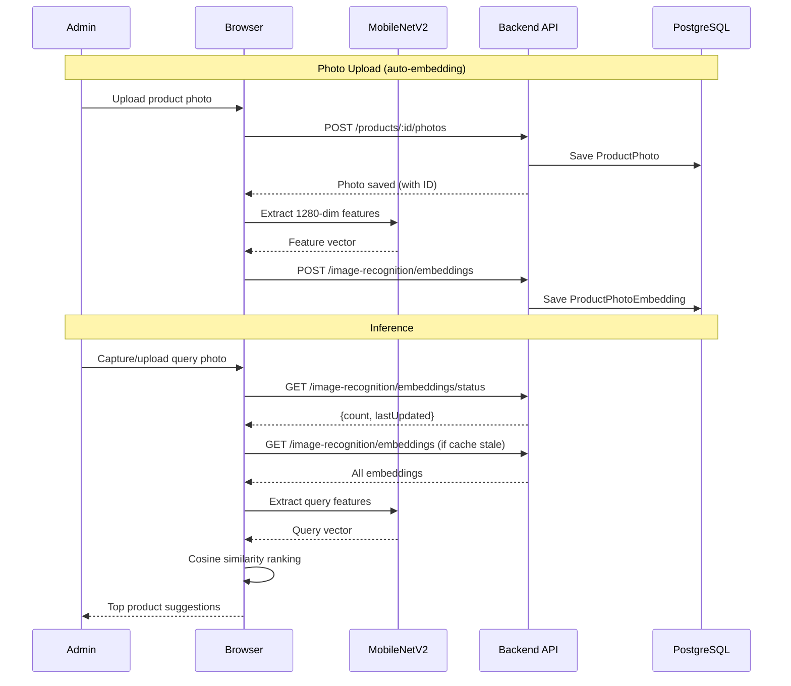

## Context

The current image recognition system uses MobileNetV2 as a feature extractor followed by a custom classification head (Dense 256 → 128 → numClasses) trained in the browser. With ~2 photos per product across 170 classes, the classifier cannot learn reliable decision boundaries. Training takes 15+ minutes and produces unreliable predictions.

MobileNetV2 already produces excellent 1280-dimensional feature vectors where visually similar images cluster together. By comparing these vectors directly via cosine similarity instead of training a classifier, we eliminate the training bottleneck and get naturally better results.

The existing codebase has:
- `image-recognition.service.ts` with `preprocessImage`, `loadFeatureExtractor`, `extractImageFeatures` producing 1280-dim vectors
- `model-training.service.ts` with `executeClientSideTraining` that downloads photos, extracts features, trains, and uploads
- `sales.service.ts` with `imageRecognitionService` API client
- Backend `ImageRecognitionController` serving model files, metadata, training dataset
- `ai-model.tsx` admin page for training management
- `product-photo-upload.tsx` for photo upload/delete lifecycle

## Goals / Non-Goals

**Goals:**
- Replace classifier-based inference with cosine similarity over stored embeddings as the default recognition path
- Reduce "model retraining" from 15+ minutes to ~30-60 seconds of embedding generation
- Auto-generate embeddings when photos are uploaded, auto-delete when photos are removed
- Provide a full rebuild option for initial setup or bulk regeneration
- Preserve the existing classifier as a fallback when no embeddings exist

**Non-Goals:**
- Removing or deprecating the existing classifier training UI -- it stays as a fallback
- Server-side similarity computation (all ML stays in the browser)
- Using pgvector or any vector database extension -- similarity is computed client-side
- Approximate nearest neighbor (ANN) search -- with ~366 vectors, brute-force cosine similarity is <1ms
- Configurable similarity thresholds via UI (fixed thresholds for now, tuneable in code)
- Offline embeddings caching in IndexedDB (embeddings index cached in memory per session)

## Decisions

### D1: Store embedding vectors as JSON text in PostgreSQL

**Decision:** Store 1280-dim float arrays as JSON text in a `text` column rather than using pgvector or a binary format.

**Rationale:** With ~366 rows × 1280 floats × ~8 bytes (JSON) ≈ 3MB, this is trivial for PostgreSQL. The database only needs to bulk-read all embeddings -- no server-side similarity queries. Using `text` avoids adding the pgvector extension (which complicates RDS setup) and keeps the architecture simple.

**Alternatives considered:**
- **pgvector column:** Overkill -- we never query by similarity on the server. Adds extension dependency to RDS.
- **Binary blob:** Smaller storage but harder to debug and inspect.
- **Separate file storage (S3):** Adds complexity; the data is small enough for the DB.

### D2: One embedding row per photo (not per product)

**Decision:** Create a `ProductPhotoEmbedding` row for each `ProductPhoto`, storing the photo's individual feature vector.

**Rationale:** Products with more photos have more visual angles covered, increasing match probability. During inference, we compute max similarity across all photos for a product. This also makes lifecycle management trivial: when a photo is added, add one embedding; when deleted, delete one embedding.

**Alternatives considered:**
- **Average embedding per product:** Loses information. A ring photographed from the top and side produces very different vectors; averaging them loses both signals.
- **Centroid + individual:** Unnecessary complexity for 366 vectors.

### D3: Cosine similarity computed in the browser

**Decision:** Download all embeddings to the browser and compute cosine similarity client-side using Float32Arrays.

**Rationale:** Consistent with the existing architecture where all ML runs in the browser. 366 comparisons of 1280-dim vectors takes <1ms on any modern device. The embeddings index (~1.8MB as Float32Array, ~3MB as JSON transfer) is comparable to the current model weight files (~14MB).

**Alternatives considered:**
- **Server-side similarity API:** Adds server-side ML dependency, increases latency with network round-trips, inconsistent with browser-first architecture.
- **WebAssembly SIMD acceleration:** Premature optimization -- vanilla JS with Float32Arrays is fast enough.

### D4: Embeddings auto-generated on photo upload

**Decision:** After a photo is uploaded in `product-photo-upload.tsx`, extract its MobileNetV2 features and save the embedding via the API automatically.

**Rationale:** Eliminates the need for manual "retraining" when the catalog changes. Each photo upload takes ~1-2 seconds extra for feature extraction (MobileNetV2 is already cached after first load). The embedding is immediately available for inference.

**Alternatives considered:**
- **Batch-only generation:** Simpler but requires manual rebuild after every photo change.
- **Server-side extraction:** Would require TensorFlow on the server, contradicting the browser-first approach.

### D5: Similarity thresholds

**Decision:** Use two thresholds:
- `SIMILARITY_THRESHOLD = 0.70` -- minimum cosine similarity to include a product in suggestions
- `MIN_TOP_SIMILARITY = 0.50` -- minimum for the top match to return any results at all

**Rationale:** Cosine similarity on MobileNetV2 features typically produces values between 0.3 (very different) and 0.99 (near-identical). The 0.70 threshold is conservative and should be tuned after testing with real jewelry products. The 0.50 floor prevents returning garbage results when the query image is completely unrelated.

**Alternatives considered:**
- **Single threshold:** Less control over edge cases.
- **Dynamic threshold (mean + std):** Over-engineered for the current scale.

### D6: Fallback to classifier when no embeddings exist

**Decision:** `recognizeProduct` checks embedding count via `GET /api/image-recognition/embeddings/status`. If count > 0, use similarity; otherwise, fall back to the existing classifier path.

**Rationale:** Ensures the system works during migration and for installations that haven't generated embeddings yet. Zero-effort backward compatibility.

## Architecture

## Risks / Trade-offs

- **[Cold cache latency]** First inference in a session requires downloading all embeddings (~3MB JSON). → Mitigation: Cache in memory; check staleness via lightweight status endpoint before re-fetching.
- **[MobileNetV2 load time on photo upload]** First photo upload in a session triggers MobileNetV2 download (~14MB). → Mitigation: Already the case for classifier inference; lazy load with progress indicator.
- **[Threshold tuning]** The 0.70/0.50 thresholds are educated guesses. Jewelry items (rings, necklaces) may have high intra-class variance. → Mitigation: Start conservative, adjust based on real usage feedback. Thresholds are constants, easy to tune.
- **[Embedding version drift]** If MobileNetV2 URL changes (TF Hub update), old embeddings become incompatible with new feature vectors. → Mitigation: Pin the exact MobileNetV2 model URL. Full rebuild regenerates all embeddings if needed.
- **[No offline support for embeddings]** Unlike the classifier model (cached in IndexedDB), embeddings are only cached in memory. → Mitigation: Acceptable for MVP. If offline support is needed, embeddings can be persisted in IndexedDB with the same version-check pattern used for the model.

## Migration Plan

1. **Database migration**: Run `dotnet ef migrations add AddProductPhotoEmbeddings` to create the table. Non-destructive -- no existing tables are modified.
2. **Deploy backend**: New endpoints are additive. No existing endpoints change.
3. **Deploy frontend**: New similarity code paths are gated behind `embeddingsStatus.count > 0`. Until embeddings are generated, the system uses the existing classifier.
4. **Generate embeddings**: Admin clicks "Generar Embeddings" on the AI model page. Takes ~30-60 seconds for ~366 photos. System is live with similarity inference after completion.
5. **Rollback**: If issues arise, delete all embeddings (`DELETE /api/image-recognition/embeddings`). System automatically falls back to classifier.

## Open Questions

- Should the embeddings index response use a more compact binary format (e.g., base64-encoded Float32Array) to reduce transfer size from ~3MB JSON to ~1.8MB? Decision deferred -- JSON is simpler and the size difference is negligible on modern connections.
- Should we pre-compute and cache per-product "best representative" embeddings for faster matching? Not needed at current scale.
